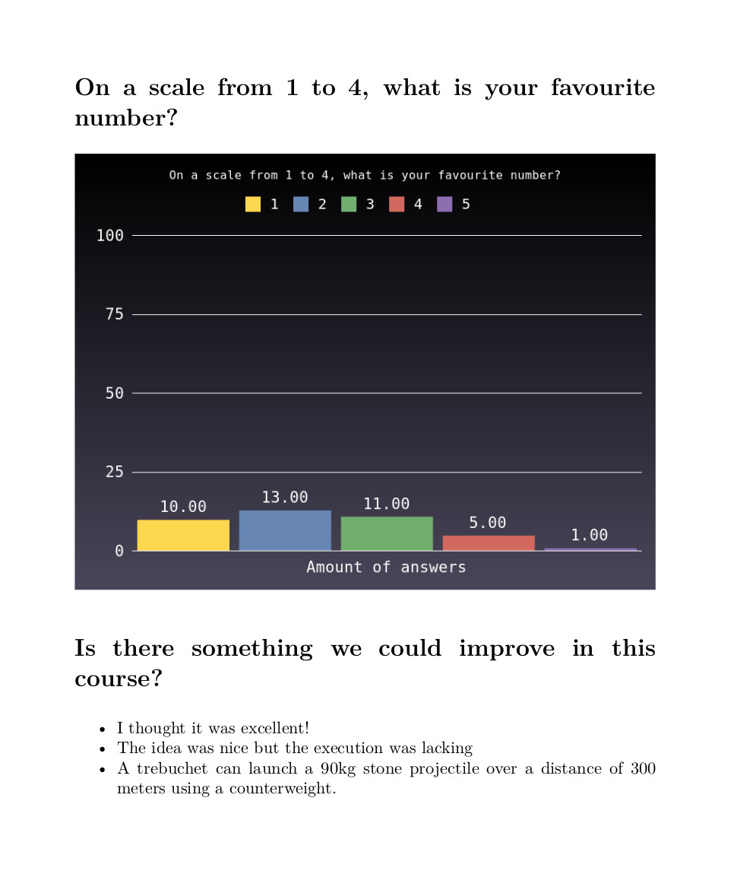

# Evaluby

Evaluby, pronounced eva-looby (/ɛvɑ'lu:bj/) - yes, the phonetic spelling was totally necessary - is a piece of software written in Ruby that's supposed to make it easier to evaluate questionnaires. It's mainly meant for evaluating questionnaires on paper that you can digitalize by typing with the help of Evaluby. In other words, Evaluby hopefully makes it a bit easier for you to digitalize paper questionnaires and later do a small amount of graphing for "presenting" the results of your questionnaires:

The resulting format is a pdf, but it's just composed of individual markdown, latex and png files that get merged together with pandoc.
Evaluby uses Gruff as a graphing tool.

## Installation/Usage

Just clone the git repo and you're pretty much set. To start the digitalizing of your questionnaire, execute questionnaireReader.rb. For producing the evaluation and the graphs, execute statisticalEvaluation.rb after you've finished digitalizing your questionnaires.
In order to make it possible for your questionnaire to be digitalized, Evaluby needs a few files:
- First of all, name your questionnaire with something short, so you can remember it. Place a directory with that name under data and evaluation. I.e. `mkdir data/example evaluation/example`
- Into `templates/`, place two files: `example.tp` and `example.fmt`. These files are used so Evaluby knows how the questionnaire looks like. 
- Into `example.fmt`, put your questions and, for multiple choice questions, their answers (keep these short, they will appear in the graph. Something like 'disagree' and 'agree' is ideal).
- Into `example.tp`, put the *kind* of question. For example, there are multiple choice questions (`multN`, where N is the number of choices), plain text questions (`plain`) and multiple choice questions where people are allowed multiple answers and there is a `other` field where people may write what they please (`manyNOtherM`, where N is the number of choices and M is the position of the other field, i.e. the number of the choice with the `other` field).
- You can now start digitalizing: execute `questionnaireReader.rb`. Evaluby will tell you the format of each question and will refuse to continue if you make a mistake. For example, when you type `5` in a multiple choice question with just 3 answers (`mult3`), it won't enter that wrong number and you'll instead have to retype it. For multiple choice questions, just type the number of the choice that person ticked (first choice is `1`). If multiple answers are allowed, just enter each number with spaces in between.
- For multiple choice questions with 'other' fields, it's a bit more complicated: Let's say the question has five choices and the other field is at position two (i.e. second position, the indices are starting with 1 here). This would be a `mult5Other2` question. Let the question be "Which Linux distributions have you used before?". Possible answers are "Ubuntu", "Other: ...", "Linux Mint", "Fedora", "Arch Linux". If the person who answers the questionnaire has used Ubuntu, Debian and Fedora before, he'd obviously tick Ubuntu (1), Fedora (4) and the 'other' field (2) and write "Debian" into that field. So for digitalizing that particular, just type `1 4 2Debian`. The order of the numbers doesn't matter, so `4 2Debian 1` would work as well.
- After you have done your digitalizing work, just stop the script with Ctrl-C. Then you can execute statisticalEvaluation.rb. The evaluated questionnaires will land in `evaluation/` where you should execute `./build.sh` if you want to pack all the files into a pdf.

